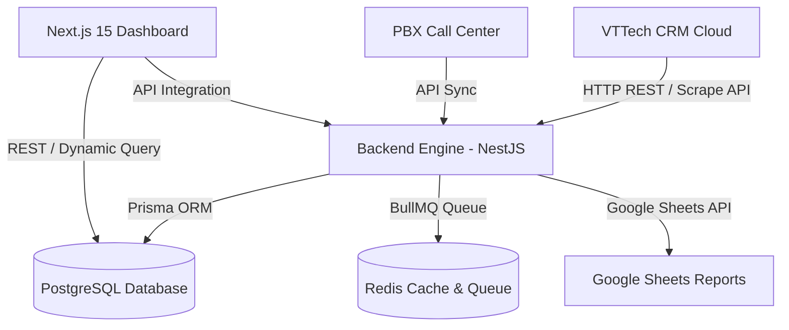

# 📘 BÁO CÁO BÀN GIAO DỰ ÁN KATACORE VTTECH SYNC & DASHBOARD
**Dành cho: Công ty TNHH Tazagroup**

---

## 1. 📌 Tổng Quan Hệ Thống

Hệ thống **KataCore VTTech Engine & Analytics Dashboard** là giải pháp toàn diện được xây dựng riêng cho **Tazagroup** nhằm:
- **Tự động đồng bộ thời gian thực (Real-time & Cron) và toàn vẹn 100% dữ liệu** từ hệ thống VTTech CRM (bao gồm 17 chi nhánh: Taza Skin Clinic, Timona, Hderma,...).
- **Hệ thống PBX Call Center Sync**: Tự động cào và đồng bộ dữ liệu lịch sử cuộc gọi, file ghi âm cuộc gọi của nhân viên.
- **Hệ thống Google Sheets Exporter**: Tự động đẩy báo cáo doanh thu, hồ sơ điều trị, lịch hẹn lên Google Sheets theo định kỳ.
- **Bảng điều khiển Analytics Dashboard**: Giao diện quản trị hiện đại (Next.js 15, Tailwind CSS, Shadcn UI, Dark Mode) giúp Ban Giám đốc và Sale Admin theo dõi báo cáo doanh thu, khách hàng, lịch hẹn, điều trị và log vận hành hệ thống.

---

## 2. 🏗️ Kiến Trúc Hệ Thống (System Architecture)



### Các thành phần chính:
1. **Backend Engine (`backend-api`)**:
   - **Framework**: NestJS (TypeScript) chạy trên Node.js/Bun.
   - **Database ORM**: Prisma ORM làm việc với PostgreSQL.
   - **Queue Engine**: BullMQ + Redis quản lý hàng đợi sync không lo sập server hay nổ memory khi sync lượng lớn dữ liệu.
2. **Frontend Dashboard (`vttech-dashboard`)**:
   - **Framework**: Next.js 15 (App Router, React 19).
   - **UI Library**: Shadcn UI + Tailwind CSS, Recharts, Lucide Icons.
   - **Data Handling**: Advanced Data Tables với bộ lọc nâng cao, export Excel/CSV, Server-side pagination.
3. **Database Layer (`PostgreSQL`)**:
   - Chứa toàn bộ dữ liệu 17 chi nhánh, hơn 1,600 nhân viên, 1,700+ dịch vụ, hàng trăm ngàn lịch hẹn, doanh thu và hồ sơ điều trị.

---

## 3. 🚀 Hướng Dẫn Vận Hành & Triển Khai (Quick Start)

### 3.1 Triển khai bằng Docker Compose (Khuyên dùng)
Dự án đã được đóng gói sẵn trong file `docker-compose.yml` ở thư mục gốc:

```bash
# 1. Khởi động toàn bộ dịch vụ (Postgres, Redis, Backend, Frontend)
docker-compose up -d --build

# 2. Kiểm tra trạng thái các container
docker-compose ps

# 3. Xem log vận hành
docker-compose logs -f
```

### 3.2 Triển khai thủ công (Local / Server Dev)

#### Bước 1: Khởi chạy Backend (`backend-api`)
```bash
cd backend-api

# Cài đặt thư viện
bun install # hoặc npm install

# Chạy Migration Database
npx prisma db push

# Chạy server ở chế độ Production / Dev
bun run start:prod # hoặc bun run start:dev
```
Backend sẽ lắng nghe tại port: `http://localhost:3001` (hoặc cấu hình trong `.env`).

#### Bước 2: Khởi chạy Frontend (`vttech-dashboard`)
```bash
cd vttech-dashboard

# Cài đặt thư viện
bun install # hoặc npm install

# Build & Chạy Frontend
bun run build
bun run start
```
Frontend Dashboard sẽ lắng nghe tại port: `http://localhost:3000`.

---

## 4. 🗄️ Cấu Trúc Dữ Liệu (Database Schema)

Cơ sở dữ liệu PostgreSQL (qua Prisma) lưu trữ đầy đủ các bảng dữ liệu sau:

| Tên Bảng | Chức năng | Ghi chú |
|---|---|---|
| `branches` | Danh sách 17 Chi nhánh | Taza Skin Clinic, Timona, Hderma... |
| `employees` | Danh sách Nhân viên (1,600+) | Bác sĩ, KTV, Sale Admin, Telesale... |
| `services` | Danh mục Dịch vụ (1,700+) | Loại dịch vụ, bảng giá, nhóm dịch vụ |
| `customers` | Hồ sơ Khách hàng | Mã KH, tên, SĐT, địa chỉ, nguồn KH |
| `appointments` | Lịch hẹn khách hàng | Trạng thái đặt hẹn, ngày hẹn, chi nhánh |
| `revenue_records` | Báo cáo doanh thu ngày | Doanh thu thực thu, doanh số chốt, KH mới/cũ |
| `treatments` / `payment_cards` | Thẻ liệu trình & Thanh toán | Chi tiết thanh toán, buổi điều trị |
| `pbx_call_records` | Lịch sử cuộc gọi tổng đài PBX | Số gọi, số nhận, thời lượng, file ghi âm |
| `gsheet_export_logs` | Nhật ký đẩy Google Sheets | Thời gian đẩy, số lượng dòng, trạng thái |
| `cron_settings` | Bảng điều khiển Cronjob | Cấu hình bật/tắt & chu kỳ sync |

---

## 5. 🔄 Quy Trình Đồng Bộ & Tính Năng Tự Động

1. **Auto VTTech Incremental Sync**:
   - Chạy định kỳ 5-15 phút/lần tự động cào dữ liệu mới phát sinh từ VTTech webapp.
2. **Auto PBX Call Records Sync**:
   - Đồng bộ nhật ký cuộc gọi và liên kết với hồ sơ khách hàng.
3. **Auto Google Sheets Reporting Engine**:
   - Tự động ghi báo cáo theo sheet ID được cấu hình.
4. **BullMQ Worker Queue**:
   - Tự động chia nhỏ các batch sync dữ liệu lớn thành từng công việc nhỏ trong Redis Queue, giúp hệ thống hoạt động vô cùng êm ái, RAM tiêu thụ thấp (<300MB).

---

## 6. 🔑 Tài Khoản Mặc Định & Cấu Hình Môi Trường

### Dashboard Login Defaults:
- **Tài khoản**: `admin` / `admin` hoặc `tranmyduyen` / `tranmyduyen`

### Biến Môi Trường Cần Lưu Ý (`.env`):
- `DATABASE_URL`: Chuỗi kết nối PostgreSQL.
- `REDIS_HOST` / `REDIS_PORT`: Kết nối Redis Queue.
- `VTTECH_USERNAME` / `VTTECH_PASSWORD`: Tài khoản cào dữ liệu VTTech.
- `GOOGLE_SERVICE_ACCOUNT_JSON`: Key tài khoản Google Service cho Google Sheets.

---

**Đơn vị phát triển bàn giao**: Katacore Team  
**Ngày hoàn tất bàn giao**: 04/08/2026
