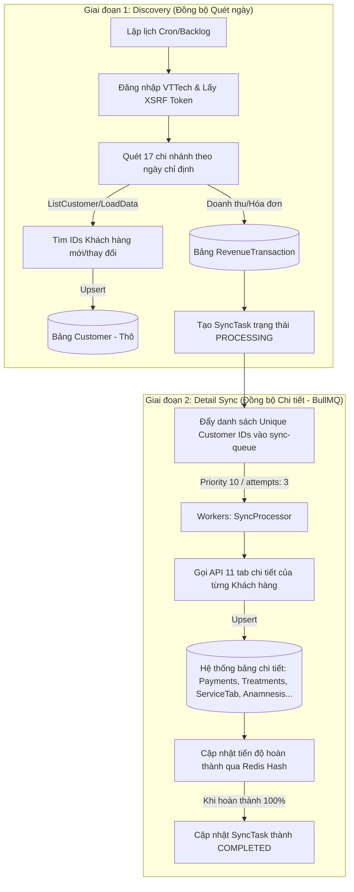

# ĐÁNH GIÁ XUNG ĐỘT KHI CHẠY CRONJOB ĐỒNG BỘ HỒI QUY LỊCH SỬ (RETROACTIVE SYNC)

Báo cáo này tập trung phân tích sâu các rủi ro, xung đột (kỹ thuật, dữ liệu, hệ thống) và đề xuất giải pháp tối ưu khi triển khai **Cronjob đồng bộ hồi quy ngược về quá khứ** theo mô hình 2 bước:
1. **Bước 1 (Buoc1.md):** Quét & lấy danh sách toàn bộ khách hàng và phát sinh giao dịch của toàn bộ 17 chi nhánh theo từng ngày.
2. **Bước 2 (Buoc2.md):** Đi sâu vào từng khách hàng để cập nhật đầy đủ thông tin chi tiết qua 11 tab chức năng (thông tin cá nhân, tiền sử bệnh lý, thanh toán tài chính, hình ảnh trước/sau điều trị,...).

---

## 🧭 1. Khái Quát Quy Trình Đồng Bộ 2 Bước

Kiến trúc hiện tại của dự án NestJS được tổ chức tách biệt làm 2 giai đoạn chính:



Quy trình này hoạt động rất tốt đối với việc đồng bộ cuốn chiếu hàng ngày (`handleDailySync` và `handleFrequentSync`). Tuy nhiên, khi **cày ngược lịch sử về quá khứ (từ năm 2019 đến nay)**, hệ thống sẽ đối mặt với các xung đột cực kỳ nghiêm trọng dưới đây.

---

## ⚠️ 2. Các Xung Đột & Rủi Ro Nghiêm Trọng Khi Chạy Hồi Quy

### 1. Xung Đột Ghi Đè Dữ Liệu Ngược Dòng Thời Gian (Chronological Overwrite Conflict)
* **Nguyên nhân:** VTTech Portal không lưu trữ lịch sử thay đổi phiên bản (versioning) cho các trường thông tin cơ bản của khách hàng (như Tên, Số điện thoại, Địa chỉ, Người chăm sóc CSKH) mà chỉ lưu trạng thái **hiện tại mới nhất**.
* **Cơ chế xung đột trong code hiện tại:**
  Trong file `sync.service.ts` (dòng 856-874), hệ thống tính toán mã băm `currentHash` từ dữ liệu quét được của ngày lịch sử và so sánh với `last_hash` trong DB cục bộ:
  ```typescript
  const currentHash = this.generateHash({ name, phone, email, paid, debt... });
  const existingCustomer = await this.prisma.customer.findUnique({ where: { id } });
  if (!existingCustomer || existingCustomer.last_hash !== currentHash) {
    await this.prisma.customer.upsert({ ... })
  }
  ```
  Nếu một khách hàng được tạo năm 2020 có số điện thoại cũ là `090XXXXXXX`, sau đó họ đổi sang số điện thoại mới `036XXXXXXX` vào năm 2026.
  * Khi Cronjob chạy ngày hiện tại (năm 2026), DB ghi nhận số điện thoại mới của họ.
  * Khi Cronjob hồi quy lịch sử quét đến ngày tạo năm 2020, API VTTech trả về bản ghi năm 2020 với số điện thoại cũ (hoặc ngược lại). Sự sai khác này làm thay đổi `currentHash`, kích hoạt câu lệnh `upsert` và **ghi đè ngược số điện thoại cũ/dữ liệu cũ đè lên dữ liệu mới nhất của năm 2026**.
* **Hậu quả:** Sai lệch toàn bộ dữ liệu liên hệ, CSKH và thông tin cá nhân mới nhất của khách hàng trong DB cục bộ.

### 2. Nguy Cơ Bị Khóa Tài Khoản & Chặn IP từ VTTech CRM (API Rate Limiting & IP Blocking)
* **Nguyên nhân:** Đồng bộ lịch sử từ năm 2019 đến nay đòi hỏi quét một khoảng thời gian khổng lồ:
  $$\text{7 năm} \times 365 \text{ ngày} \times 17 \text{ chi nhánh} \approx 43,435 \text{ lượt quét chi nhánh-ngày (Step 1)}$$
* Ở **Bước 2**, mỗi khách hàng cần gọi khoảng **11-13 API** để lấy đủ thông tin các tab. Giả sử hệ thống có 20,000 khách hàng trong lịch sử:
  $$20,000 \text{ khách hàng} \times 11 \text{ API/khách hàng} = 220,000 \text{ API requests!}$$
* **Hậu quả:** Tần suất truy vấn quá dày đặc sẽ kích hoạt hệ thống tường lửa (WAF/IPS) hoặc chính sách chống cào dữ liệu (Anti-scraping) của máy chủ VTTech Portal. Hệ thống sẽ:
  * Trả về mã lỗi `429 Too Many Requests` hoặc `403 Forbidden`.
  * Khóa tài khoản đồng bộ `ittest123`.
  * Chặn (Ban) vĩnh viễn IP của máy chủ NestJS Backend, làm tê liệt toàn bộ luồng đồng bộ thời gian thực.

### 3. Xung Đột Phiên Làm Việc (Session & Token Race Conditions)
* **Nguyên nhân:** Luồng đồng bộ thời gian thực (`handleFrequentSync` mỗi 20 phút) và luồng cày lịch sử (`handleHistoricalSyncCron` mỗi 30 phút) đều sử dụng chung danh sách tài khoản cấu hình trong `VTTECH_ACCOUNTS` (tài khoản `ittest123`).
* **Cơ chế xung đột:**
  VTTech Portal sử dụng cơ chế session dựa trên Cookie `.AspNetCore.Session` và XSRF Token từ thẻ `__RequestVerificationToken`. 
  Khi hai Cronjob chạy song song cùng gửi yêu cầu đăng nhập hoặc làm mới token:
  * Một cronjob có thể vô tình hủy phiên (invalidate cookie) của cronjob còn lại.
  * Dẫn đến lỗi `Session Expired` hoặc `Invalid XSRF Token` liên tục, gây gián đoạn chéo và làm thất bại cả hai luồng đồng bộ.

### 4. Gây Quá Tải Hàng Đợi Redis & Tràn Bộ Nhớ (BullMQ Queue Flood & OOM)
* **Nguyên nhân:** Nếu chúng ta kích hoạt đồng bộ hồi quy diện rộng mà không kiểm soát tốc độ, hàng chục nghìn job chi tiết khách hàng (`sync-customer-detail`) sẽ được đẩy vào hàng đợi Redis cùng một lúc.
* **Hậu quả:** 
  * Tiêu tốn dung lượng RAM cực lớn trên Redis, có thể dẫn đến tràn bộ nhớ (Out of Memory - OOM) và sập dịch vụ Redis.
  * Làm nghẽn hàng đợi, khiến các job đồng bộ doanh số và khách hàng của ngày hôm nay (vốn cần hiển thị ngay lập tức trên Dashboard hành chính) phải xếp hàng chờ đợi hàng tiếng đồng hồ sau các job lịch sử cũ từ năm 2019.

### 5. Bế Tắc Khóa Hàng Cơ Sở Dữ Liệu (PostgreSQL Row Locking & Deadlocks)
* **Nguyên nhân:** Khi chạy cày lịch sử, nhiều Worker của BullMQ chạy song song (`concurrency: 4` hoặc cao hơn) có thể xử lý các ngày khác nhau nhưng chứa cùng một khách hàng (ví dụ: một khách hàng thân thiết có lịch sử giao dịch phát sinh qua nhiều năm).
* **Cơ chế xung đột:** Các worker này sẽ đồng thời thực hiện lệnh `upsert` vào các bảng quan hệ như `CustomerPayment`, `CustomerServiceTab`, `Treatment` cho cùng một `customer_id`.
* **Hậu quả:** Gây ra hiện tượng tranh chấp tài nguyên khóa hàng (Row Lock Contention) trong PostgreSQL, dẫn đến lỗi `DeadlockDetectedException` (lỗi bế tắc giao dịch), làm hủy bỏ tiến trình ghi dữ liệu của worker và khiến dữ liệu bị mất mát hoặc không đồng bộ đầy đủ.

---

## 🛠️ 3. Giải Pháp Khắc Phục & Kiến Trúc Tối Ưu

Để chạy đồng bộ hồi quy lịch sử an toàn, hiệu quả mà **không gây ra bất kỳ xung đột nào**, chúng ta cần triển khai các giải pháp cải tiến dưới đây:

### 1. Cơ Chế Bảo Vệ Dòng Thời Gian (Timeline Guard)
* **Giải pháp:** Sử dụng mốc thời gian cập nhật để bảo vệ dữ liệu mới nhất.
* **Cách thực hiện:** 
  * Khi cập nhật thông tin cá nhân khách hàng ở Bước 1 & Bước 2, hệ thống phải so sánh ngày cập nhật dữ liệu.
  * Thêm trường `updated_at` từ VTTech (nếu có) hoặc chỉ cho phép cập nhật thông tin cá nhân khách hàng (`Customer`) nếu `SyncTask.date` của phiên chạy hiện tại **lớn hơn hoặc bằng** ngày cập nhật gần nhất được lưu trong DB cục bộ.
  * Lịch sử giao dịch (Payments, Treatments, Services) thì vẫn được thêm bình thường vì chúng có ID giao dịch duy nhất riêng biệt, không lo ghi đè chéo.

### 2. Thiết Lập Tài Khoản CSKH / Đồng Bộ Chuyên Biệt Cho Luồng Lịch Sử
* **Giải pháp:** Tách biệt tài khoản vận hành để tránh xung đột Session.
* **Cách thực hiện:**
  * Luồng đồng bộ thời gian thực hàng ngày: Sử dụng tài khoản chính (ví dụ: `ittest123`).
  * Luồng đồng bộ hồi quy lịch sử: Yêu cầu cấp thêm một tài khoản phụ riêng biệt trên VTTech Portal (ví dụ: `itsync_history`).
  * Nhờ đó, việc đăng nhập và duy trì cookie của hai tiến trình hoàn toàn độc lập, loại bỏ 100% nguy cơ đè phiên làm việc.

### 3. Phân Cấp Ưu Tiên Hàng Đợi BullMQ (Strict Queue Prioritization)
* **Giải pháp:** Đảm bảo dữ liệu hiện tại luôn được xử lý trước.
* **Cách thực hiện:**
  * Gán độ ưu tiên cực cao cho các tác vụ đồng bộ ngày hiện tại: `priority: 1` hoặc `5`.
  * Gán độ ưu tiên cực thấp cho các tác vụ cày lịch sử: `priority: 25` hoặc `30`.
  * Nhờ cơ chế ưu tiên của BullMQ, ngay cả khi hàng đợi có 50,000 job lịch sử đang chờ, Worker vẫn sẽ lập tức rút các job thời gian thực của ngày hôm nay ra xử lý trước ngay khi chúng xuất hiện.

### 4. Thuật Toán Bỏ Qua Chi Tiết Thông Minh (Smart Skip Strategy)
* **Giải pháp:** Tránh gọi API vô ích để giảm tải 90% truy vấn.
* **Cách thực hiện:**
  * Trước khi tiến hành gọi 11 tab chi tiết ở Bước 2 cho một khách hàng lịch sử, hãy thực hiện kiểm tra nhanh trong DB cục bộ:
    * Khách hàng đã tồn tại trong DB chưa?
    * Số dư công nợ và tổng chi tiêu (`total_spent`, `total_debt`) trong DB cục bộ hiện tại đã khớp chính xác với số liệu thô lấy được ở Bước 1 chưa?
  * Nếu số liệu tài chính đã hoàn toàn khớp và khách hàng không có cập nhật gì mới, hệ thống **bỏ qua việc quét 11 tab chi tiết** cho khách hàng đó. Giải pháp này giúp giảm tải tới 90% số lượng request API lên cổng VTTech.

### 5. Kiểm Soát Tốc Độ & Phân Lô Theo Tháng (Adaptive Rate Limiting & Monthly Batching)
* **Giải pháp:** Không chạy Cron tự động cày lịch sử dồn dập, chuyển sang cơ chế điều khiển thủ công theo lô (Batch Control).
* **Cách thực hiện:**
  * Xây dựng một giao diện quản trị hoặc API chuyên biệt để kích hoạt đồng bộ lịch sử theo từng tháng (ví dụ: "Đồng bộ Tháng 05/2020").
  * Sử dụng cơ chế ngủ sâu (`await sleep(2000)` đến `5000`) giữa các chi nhánh và các ngày quét để mô phỏng hành vi của người dùng thật, tránh bị tường lửa VTTech quét IP.
  * Giới hạn `concurrency` của Worker cày lịch sử ở mức `1` hoặc `2` để bảo vệ tài nguyên RAM Redis và tránh gây Deadlock trong PostgreSQL.

---

## 📈 4. Kết Luận

Việc chạy **Cronjob đồng bộ hồi quy ngược về quá khứ** theo mô hình 2 bước là **hoàn toàn khả thi và cần thiết** để làm sạch cũng như đầy đủ hóa dữ liệu. Tuy nhiên, nếu sử dụng code hiện tại mà không có biện pháp phòng ngừa, hệ thống **chắc chắn sẽ gặp xung đột ghi đè dữ liệu cũ lên dữ liệu mới, đồng thời có nguy cơ cao bị khóa tài khoản hoặc chặn IP do quá tải API**.

**Khuyến nghị hướng triển khai kế tiếp:**
1. Cấu hình phân cấp độ ưu tiên `priority` trong hàng đợi BullMQ cho các task lịch sử.
2. Áp dụng cơ chế **Timeline Guard** (So sánh ngày task lớn hơn ngày cập nhật khách hàng mới cho phép ghi đè thông tin cá nhân).
3. Đăng ký tài khoản VTTech riêng chuyên chạy lịch sử trước khi kích hoạt cày diện rộng.
4. Triển khai thuật toán **Smart Skip** để tối ưu hóa hiệu năng và tránh bị khóa IP.
