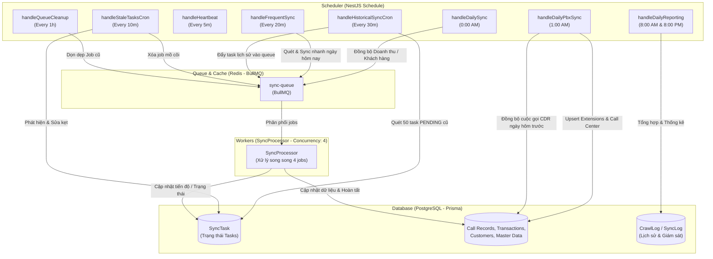

# Báo cáo Đánh giá Hệ thống Cron Job - VTTech Sync Engine

Báo cáo này cung cấp cái nhìn toàn diện về kiến trúc, cơ chế vận hành và chi tiết kỹ thuật của các **Cron Job** đang chạy trong dự án NestJS VTTech Sync Engine. 

Hệ thống được thiết kế tối ưu với sự kết hợp giữa bộ lập lịch **NestJS Schedule (`@nestjs/schedule`)** và hàng đợi **BullMQ (trên nền Redis)** để phân tải, điều phối các tác vụ đồng bộ dữ liệu lớn (Big Data Sync) từ cổng thông tin VTTech Portal và Tổng đài PBX về cơ sở dữ liệu PostgreSQL cục bộ.

---

## 🧭 Sơ đồ Kiến trúc Điều phối & Hàng đợi

---

## 📊 Danh sách Toàn bộ Cron Job trong Hệ thống

Hệ thống hiện tại đang vận hành tổng cộng **8 Cron Job** được chia thành 4 nhóm nghiệp vụ chính:

| STT | Tên Phương thức | Chu kỳ (Schedule) | Tệp Nguồn (Source File) | Vai trò & Nghiệp vụ chính |
| :--- | :--- | :--- | :--- | :--- |
| **1** | `handleDailySync` | Hàng ngày lúc `0:00 AM` | `sync.service.ts` | Đồng bộ toàn bộ dữ liệu (Doanh thu -> Khách hàng -> Chi tiết) của ngày hôm qua. |
| **2** | `handleDailyPbxSync` | Hàng ngày lúc `1:00 AM` | `pbx-sync.service.ts` | Đồng bộ Extensions, Call Center Employees và Nhật ký cuộc gọi CDR kèm File ghi âm ngày hôm trước. |
| **3** | `handleHeartbeat` | Mỗi **5 phút** (`0 */5 * * * *`) | `sync.service.ts` | Duy trì nhịp đập session (Keep-alive) cho các tài khoản VTTech để tránh bị logout. |
| **4** | `handleFrequentSync` | Mỗi **20 phút** (`0 */20 * * * *`) | `sync.service.ts` | Đồng bộ nhanh dữ liệu của ngày hiện tại (chỉ doanh thu và khách hàng phát sinh, không chạy PBX). |
| **5** | `handleHistoricalSyncCron` | Mỗi **30 phút** (`0 */30 * * * *`) | `sync.service.ts` | Tự động quét và phân bổ các task đồng bộ lịch sử còn tồn đọng (Backlog) từ năm 2019 vào hàng đợi BullMQ. |
| **6** | `handleStaleTasksCron` | Mỗi **10 phút** (`0 */10 * * * *`) | `sync.service.ts` | **Cơ chế tự chữa lành (Self-healing)**: Phát hiện và xử lý các task bị kẹt, các job mồ côi, kẹt 99% hoặc kẹt cờ hệ thống bận. |
| **7** | `handleQueueCleanupCron` | Mỗi **1 giờ** (`EVERY_HOUR`) | `sync.service.ts` | Dọn dẹp các Job cũ trong hàng đợi BullMQ (completed > 1 giờ và failed > 24 giờ) để giải phóng RAM Redis. |
| **8** | `handleDailyReporting` | Hàng ngày lúc `8:00 AM` & `8:00 PM` | `sync.service.ts` | Tổng hợp báo cáo kết quả đồng bộ tự động để lưu vào bảng giám sát `CrawlLog` hỗ trợ Dashboard. |

---

## 🔍 Phân tích Chi tiết Kỹ thuật & Chiến lược Vận hành

### 1. Cơ chế Đồng bộ Cuốn chiếu & Tránh quá tải API (Daily Chunking & Micro-delays)
Đối với các job đồng bộ khối lượng lớn như **`handleDailySync`** và **`handleHistoricalSyncCron`**, hệ thống không thực hiện quét hàng loạt toàn bộ khoảng thời gian dài (ví dụ: 1 tháng hoặc 1 năm). 
* **Chiến lược cuốn chiếu**: Dữ liệu được chia nhỏ theo **từng ngày và từng chi nhánh (branch)**. Mỗi cặp (Ngày + Chi nhánh) tạo thành một bản ghi `SyncTask` riêng biệt.
* **Tách biệt 2 giai đoạn (Discovery & Detail Sync)**:
  1. **Giai đoạn 1 (Discovery)**: Chạy quét tổng quát Doanh thu & Danh sách Khách hàng phát sinh giao dịch trong ngày đó (`HEADER` task).
  2. **Giai đoạn 2 (Detail Sync)**: Sau khi phát hiện các ID khách hàng thay đổi, hệ thống đẩy các ID này thành các job `sync-customer-detail` riêng lẻ vào hàng đợi BullMQ.
* **Nghỉ micro-delays**: Giữa các tiến trình quét phân hệ khách hàng và chi tiết, hệ thống thực hiện `await this.sleep(500)` hoặc `100ms` để tránh bị VTTech chặn IP hoặc từ chối dịch vụ (Rate Limit).

### 2. Sự Kết hợp Hoàn hảo với Hàng đợi BullMQ
Thay vì chạy đồng bộ trực tiếp trên tiến trình chính (dễ gây nghẽn Event Loop và tràn RAM), NestJS đóng vai trò là **Producer** đẩy các tác vụ vào Redis Queue. 
* **`SyncProcessor` (Worker)** sẽ đảm nhận xử lý ngầm (Background Worker) với:
  * `concurrency: 4`: Cho phép xử lý song song **tối đa 4 tác vụ** cùng lúc.
  * `lockDuration: 3600000` (1 giờ): Khóa job để một Worker khác không nhảy vào tranh chấp khi tác vụ đồng bộ chi tiết khách hàng đang chạy.
  * Phân chia `priority`: Các tác vụ đồng bộ chi tiết khách hàng (`sync-customer-detail`) được ưu tiên cao hơn (`priority: 5`) so với tác vụ quét lịch sử (`priority: 10` hoặc `20`) để đảm bảo khách hàng mới cập nhật số liệu nhanh nhất.

### 3. Cơ chế Tự Chữa Lành Độc đáo (Self-healing)
Một trong những điểm sáng nhất của hệ thống Cron là **`handleStaleTasksCron`** chạy mỗi 10 phút, giúp hệ thống hoạt động bền bỉ 24/7 mà không cần sự can thiệp thủ công:
* **Khắc phục kẹt trạng thái DB**: Nếu một task bị chuyển sang `PROCESSING` quá **45 phút** (thường do Worker bị sập đột ngột khi đang chạy), Cron sẽ tự động dọn dẹp job cũ trong BullMQ và đưa task DB trở lại `PENDING` để cày lại.
* **Giải quyết kẹt 99%**: Có những task đã hoàn thành tất cả các chi tiết khách hàng (`completed_details >= total_details`) nhưng do bất đồng bộ mà trạng thái trong DB không cập nhật được thành `SUCCESS`. Cron sẽ quét qua và cưỡng bức hoàn thành các task này.
* **Mở khóa hệ thống**: Nếu cờ hệ thống bận `isSyncing` bị kẹt `true` quá **4 giờ**, Cron tự động giải phóng cờ này về `false` để các phiên đồng bộ định kỳ tiếp theo tiếp tục hoạt động bình thường.

### 4. Đồng bộ PBX & CDR (`PbxSyncService`)
Chạy định kỳ vào lúc **1:00 AM** để đồng bộ trọn vẹn dữ liệu thoại của ngày hôm trước:
* **Extensions Sync**: Quét toàn bộ máy nhánh của tổng đài và cập nhật vào bảng `pbxExtension`.
* **Employees Sync**: Khớp nối nhân viên với nhóm call center tương ứng và lưu vào bảng `pbxEmployee`.
* **CDR Sync**: Lấy lịch sử cuộc gọi từ hệ thống PBX trung tâm thông qua `pbxApi.fetchAllCdrRecords(yesterday, yesterday)`. Quá trình này sẽ thực hiện `upsert` vào bảng `pbxCallRecord` dựa trên trường `uuid` duy nhất để tránh trùng lặp dữ liệu, đồng thời phân tích trạng thái cuộc gọi (`ANSWERED`, `NO_ANSWER`, `BUSY`, `CANCELED`) và lưu trữ đường dẫn file ghi âm cuộc gọi.

---

## 🛠️ Trạng thái Cấu hình Môi trường liên quan đến Cron

Các tham số cấu hình liên quan trong `.env` giúp điều hướng các Cron Job và kết nối dịch vụ:
* `DATABASE_URL`: Kết nối cơ sở dữ liệu PostgreSQL chứa các bảng `SyncTask`, `CrawlLog`, `PbxSyncLog`, `RevenueTransaction`,...
* `REDIS_HOST` & `REDIS_PORT`: Kết nối với Redis để vận hành hàng đợi BullMQ (`sync-queue`).
* `TZ=Asia/Ho_Chi_Minh`: Đảm bảo đồng bộ múi giờ Việt Nam (+7) giúp các hàm lấy ngày hôm nay (`today`) và hôm qua (`yesterday`) hoạt động chính xác vào lúc nửa đêm.
* `VTTECH_ACCOUNTS`: Danh sách tài khoản đồng bộ dùng để chạy giữ session (`handleHeartbeat`).
* `VTTECH_BASE_URL`: Địa chỉ máy chủ VTTech Portal.
